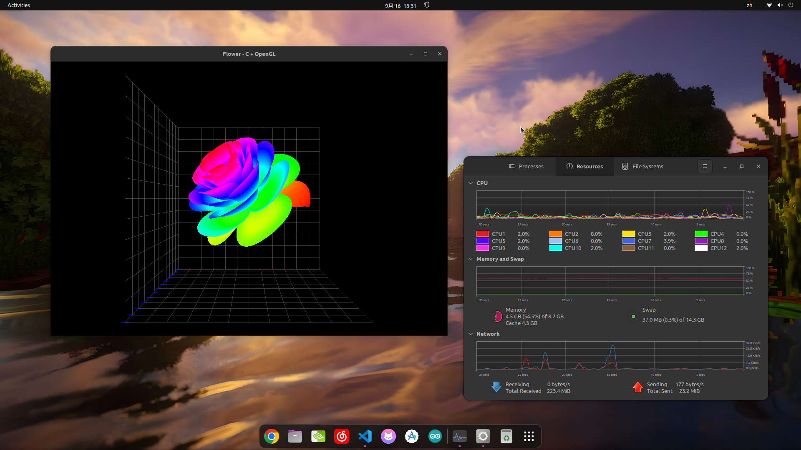

# Flower C + OpenGL

A 3D mathematical flower model rendered with C language + OpenGL, supporting real-time rotation, zooming, and a fixed coordinate grid.



## Project Structure

```
flower_opengl/
├── src/
│   └── main.c           # Main program (~470 lines)
├── shaders/
│   ├── flower.vert      # Vertex shader
│   └── flower.frag      # Fragment shader
├── CMakeLists.txt       # Build configuration
└── README.md            # Project documentation
```

### Mathematical Model

The flower surface is generated by a parametric equation using three parameters:

- **t**: Spiral angle parameter, covering approximately 17π radians
- **p**: Polar angle attenuation function, p = (π/2) · exp(-t / 8π)
- **u**: Petal shape modulation function, controlling the degree of petal opening

Each vertex coordinate is calculated using the following formulas:

```
x = r · cos(t)
y = r · sin(t)
z = u · (x_param · cos(p) - y_param · sin(p))
```

Where r = u · (x_param · sin(p) + y_param · cos(p)), and y_param controls the curvature of the petals.

## Ubuntu 22.04 Dependencies

```bash
sudo apt update
sudo apt install build-essential cmake pkg-config libglfw3-dev libgl1-mesa-dev
```

## Windows Dependencies

### Method 1: vcpkg (Recommended)

```bash
# Install vcpkg
git clone https://github.com/microsoft/vcpkg.git
cd vcpkg
.\bootstrap-vcpkg.bat
.\vcpkg install glfw3:x64-windows
```

### Method 2: MSYS2

```bash
# Install MSYS2: https://www.msys2.org/
pacman -S mingw-w64-x86_64-glfw mingw-w64-x86_64-cmake mingw-w64-x86_64-gcc
```

### Method 3: Manual Download

Download 64-bit Windows precompiled libraries from the [official GLFW website](https://www.glfw.org/download.html).

## Building

### Linux / macOS

```bash
cmake -S . -B build -DCMAKE_BUILD_TYPE=Release
cmake --build build -j$(nproc)
```

### Windows (MSVC)

```bash
cmake -S . -B build -DCMAKE_TOOLCHAIN_FILE=<vcpkg_path>/scripts/buildsystems/vcpkg.cmake
cmake --build build --config Release
```

### Windows (MinGW)

```bash
cmake -S . -B build -G "MinGW Makefiles"
cmake --build build -j
```

### Windows (MinGW) - Static Build (Single EXE, No DLLs Required)

To build a standalone executable with all dependencies embedded (no external DLL files needed):

```bash
# First, configure CMake to generate shader headers
cmake -S . -B build -G "MinGW Makefiles"

# Then compile statically using GCC directly
gcc -I build -std=gnu11 -O3 -march=native -ffast-math -fopenmp ^
    -static -static-libgcc -static-libstdc++ ^
    -o build/flower.exe src/main.c ^
    -lglfw3 -lopengl32 -lgdi32 -lgomp -lmingwthrd -lwinpthread -lm
```

> **Note**: Ensure MinGW-w64 bin directory is in your PATH (e.g., `D:\MSYS\mingw64\bin`). The static build produces a single `flower.exe` (~1.1 MB) that runs on any Windows machine without requiring `glfw3.dll`, `libgomp-1.dll`, or `libwinpthread-1.dll`.

## Running

```bash
./build/flower
```

## Controls

| Operation | Function |
|-----------|----------|
| Left mouse button + drag | Rotate the flower |
| Mouse scroll wheel | Zoom (1.0 ~ 20.0) |

## Performance Monitor

The program displays real-time performance metrics in the terminal/console window:

- **FPS**: Frames per second
- **CPU**: Process CPU usage percentage
- **GPU**: Estimated GPU utilization (based on FPS ratio)

Performance info only refreshes when you interact with the window (mouse drag or scroll wheel), avoiding unnecessary terminal output during idle periods.

### Terminal Auto-Launch

- **Windows**: Automatically opens a console window if not launched from an existing terminal
- **Linux**: Automatically opens a terminal window (gnome-terminal, xterm, konsole, etc.) if stdout is not connected to a TTY

### Performance Optimization

- Uses `aligned_alloc` for 64-byte aligned memory allocation
- OpenMP `schedule(static)` for evenly distributing computational tasks
- Compilation options `-O3 -march=native -ffast-math` to maximize performance